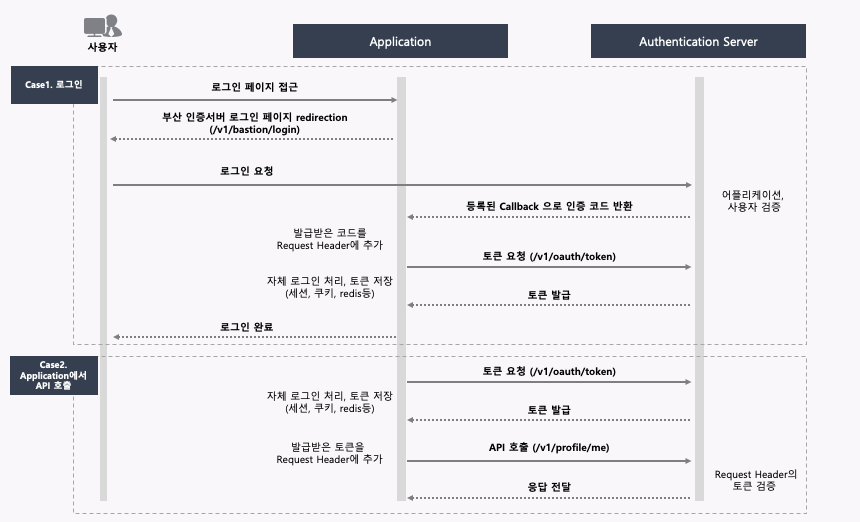

## Authentication

### Case1. 로그인 (사용자토큰)

1. 사용자가 어플리케이션에서 로그인 페이지를 요청합니다.
2. 어플리케이션은 **인증서버 로그인 페이지로** 리다이렉션 시킵니다.
3. 로그인 페이지에서 사용자는 아이디와 패스워드를 입력하고 로그인을 누릅니다.
4. 인증서버는 사용자를 검증하고, 요청한 정보로 미리 등록된 어플리케이션으로 인증코드를 반환한다.
5. 어플리케이션에서는 받은 인증코드를 헤더에 추가하여 토근을 요청한다.
6. 인증서버는 어플리케이션정보를 검증후 사용자토큰을 발급한다.
7. 어플리케이션은 발급받은 토큰을 자체적으로 저장하고, 내부 로그인을 처리한다.

### Case2. Application에서 API호출 (Application토큰)

1. 어플리케이션은 미리 발급받은 client_id, secret을 이용하여 토큰을 요청한다.
2. 발급된 토큰을 application 전역에서 사용할 수 있는 영역에 저장한다. (예) application context - 사용자와는 다른 곳에 저장해야함.)
3. 토큰을 헤더에 추가하여 필요한 API를 호출한다.



### 용어

1. Application : 쇼핑몰, 배달 쇼핑몰, 전통시장 쇼핑몰등 시스템을 의미함
2. Authentication Server (GS ITM - DevOps/Cloud Lab Bastion Application) : 인증서버


## 개발진행순서

1. 인증코드를 반환받을 Controller 준비
2. 어플리케이션 등록 (인증코드를 반환받을 URL을 전달하세요.)
3. 로그인 리다이렉션 변경을 하세요.
4. Token 관련 API를 개발하세요.
5. 사용자 정보 API를 개발하세요.

> bastion.devopscloudlab.com 호스트명은 프로젝트에서 사용하는 것으로 치환하여서 작업하세요.
> 현재 115.85.181.46 입니다.

 

## API

### 로그인 리다이렉션 변경

프로그램에서 로그인페이지로 리다이렉션 시키는 부분을 아래의 url로 변경한다.

```shell
http://bastion.o2obusan.com/v1/oauth/authorize?client_id={client_id}&response_type=code&scope=read&redirect_uri={REDIRECT_URI}
```

##### Parameter

| Name          | Type     | Description                     | Required |
| :------------ | :------- | :------------------------------ | :------- |
| client_id     | `String` | 인증서버에서 받급받은 client_id | O        |
| redirect_uri  | `String` | 인증코드 Redirect URI           | O        |
| response_type | `String` | `code`로 전달                   | O        |
| scope         | `String` | `read`로 전달                   | O        |


[Token 관련 API](../apis/token.md)<br/>
[사용자 정보 API](../apis/profile_me.md)